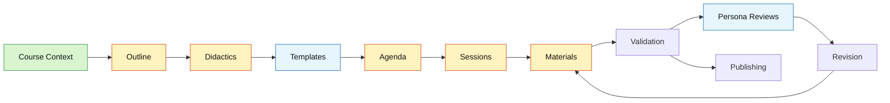

<!--
color: <span style="display:inline-block;width:1.5rem;height:1.5rem;background-color:@0;border:1px solid #ccc;border-radius:2px;vertical-align:middle;"></span> `@0`

import: https://raw.githubusercontent.com/liaScript/mermaid_template/master/README.md

@style
.dashboard {
  margin: 1.5rem 0 2rem;
  padding: 1rem;
  border: 1px solid #d7e0ea;
  border-radius: 8px;
  background: #f8fafc;
}

.dashboard-grid {
  display: flex;
  flex-wrap: wrap;
  gap: 1rem;
}

.dashboard-card {
  flex: 1 1 260px;
  min-width: 240px;
  padding: 1rem;
  border: 1px solid #d7e0ea;
  border-radius: 8px;
  background: #ffffff;
}

.dashboard-card-wide {
  flex-basis: 100%;
}

.dashboard-status {
  display: inline-block;
  padding: 0.18rem 0.5rem;
  border-radius: 999px;
  font-weight: 700;
}

.dashboard-status-done { background: #d8f5d0; color: #1b5e20; }
.dashboard-status-current { background: #fff3bf; color: #7a4d00; }
.dashboard-status-blocked { background: #ffe3e3; color: #8a1f1f; }

.dashboard table {
  width: 100%;
  border-collapse: collapse;
}

.dashboard th,
.dashboard td {
  padding: 0.35rem 0.45rem;
  border-bottom: 1px solid #e5edf5;
  text-align: left;
}

@media (max-width: 600px) {
  .dashboard-card {
    flex-basis: 100%;
    min-width: 0;
  }
}
@end
-->

# Grundlagen des Once-Only-Prinzips und Registermodernisierung

## Dashboard

<article class="dashboard">

_Generated from the project sections below. Do not edit manually._

<div class="dashboard-grid">

<div class="dashboard-card">

### Current State

__Current step:__ <span class="dashboard-status dashboard-status-current">Analysis done — drafts awaiting review</span>

__Course validation:__ <span class="dashboard-status dashboard-status-blocked">not run</span>

__Sessions complete:__ 0 / 1

__Last updated:__ 2026-09-25

</div>

<div class="dashboard-card">

### Next Commands

1. Review drafts in `## Outline`, `## Didactics`, `## Agenda`
2. `:save-decision` (1 Modul vs. 3 Module)
3. `:validate-course 1 module`
4. `:create-learner-persona`

</div>

<div class="dashboard-card">

### Quality State

<!-- data-type="none" -->
| Area | State |
| --- | --- |
| Course context | <span class="dashboard-status dashboard-status-done">done</span> |
| Outline / Didactics / Agenda | <span class="dashboard-status dashboard-status-current">draft</span> |
| Templates | <span class="dashboard-status dashboard-status-current">none needed</span> |
| Materials | <span class="dashboard-status dashboard-status-current">1 / 1 converted</span> |
| Course validation | <span class="dashboard-status dashboard-status-blocked">not run</span> |
| Persona reviews | <span class="dashboard-status dashboard-status-current">optional</span> |
| Publishing | <span class="dashboard-status dashboard-status-current">workflow + project.yaml ready, push to LiaPlayground/Demo-12 pending</span> |

</div>

<div class="dashboard-card dashboard-card-wide">

### Workflow Map



</div>

<div class="dashboard-card dashboard-card-wide">

### Session Progress

<!-- data-type="none" -->
| # | Title | Type | Skeleton | Material | Validated | Done |
| --- | --- | --- | --- | --- | --- | --- |
| 1 | Grundlagen des Once-Only-Prinzips und Registermodernisierung | `module` | ✅ | ✅ | ❌ | ❌ |

</div>

<div class="dashboard-card">

### Open Blockers

1. Outline, Didactics and Agenda are auto-generated drafts — confirm or edit before building on them.
2. Structure decision pending: one module or three (see `## Analysis Status`, item 4).
3. Image licences unknown — clear before publishing.
4. Publishing gate: `:validate-course` has not run; the export workflow is set up but the course is unvalidated.

</div>

<div class="dashboard-card">

### Quick Links

[Course Context](#course-context) · [Outline](#outline) · [Didactics](#didactics) · [Templates](#templates) · [Agenda](#agenda) · [Sessions](#sessions) · [Validation](#validation) · [Analysis Status](#analysis-status)

</div>

</div>
</article>

---

## Course Context

_Filled by `:init-course` from `templates/course-context.yaml`._

* __Course Type:__
  1. Type: improve-existing
  2. Working Title: Grundlagen des Once-Only-Prinzips und Registermodernisierung in der Verwaltung

* __Terminology:__
  1. sessions-called: Modul
  2. lectures-called: Lektion

* __Course Profile:__
  1. Persona type: coach
  2. Agenda required: optional
  3. Pacing: learner-driven
  4. Assessment defaults: self-check quizzes

* __File Structure:__
  1. Mode: multi-file — see `data/file-structure-modes.md` (erkannt aus `materials/01-once-only-prinzip/README.md`)
  2. Session folder naming: `{number}-{slug}`

* __Conventions & Standards:__
  1. Language: de
  2. Tone: formal
  3. Person: Sie
  4. Accessibility: optional (nicht festgelegt — bitte bestätigen)

* __LiaScript conventions:__
  - Material-Header: `language: de`, `narrator: Deutsch Female`, `mode: Textbook`; Version bleibt `0.x`, bis das Material freigegeben ist
  - Lernkarten und Akkordeons aus dem Rise-Original als `<details><summary>`-Blöcke; keine Template-Imports nötig
  - Diagramme als ` ```ascii `-Blöcke; keine Bindestriche in Beschriftungstexten innerhalb des Blocks (der Renderer deutet sie als Linien)
  - Hinweisboxen als GitHub-Alerts (`> [!NOTE]`, `> [!TIP]`, `> [!WARNING]`, `> [!IMPORTANT]`)
  - Wissenschecks als Single-Choice-Quiz mit `[[?]]`-Hinweisen und `***`-Lösungsblock ohne Leerzeile davor
  - Bilder unter `materials/{number}-{slug}/assets/images/`, immer mit Alt-Text und Bildunterschrift

* __Additional Notes:__
  - Ursprung: Rise-360-Export „GovTech Enablement, Kompetenzfeld 02 (KF02 wissen)“ als `todo.pdf` (34 Seiten, 3 Lektionen); konvertiert am 2026-09-25 nach `materials/01-once-only-prinzip/README.md`
  - Ein Modul (= eine Materialdatei) bündelt derzeit drei Lektionen; ob das so bleibt oder in drei Module aufgeteilt wird, ist offen (siehe `## Analysis Status`)
  - Herkunft und Lizenz der Stock-Fotos sind ungeklärt — vor Veröffentlichung prüfen oder ersetzen

---

## Outline

> **Draft (auto-generated from existing materials)** — please review and update

_Filled by `:create-outline` from `templates/course-outline.yaml`._

* __Title:__
  Grundlagen des Once-Only-Prinzips und Registermodernisierung in der Verwaltung

* __Target Audience:__
  Mitarbeitende datenhaltender Stellen in Bund, Ländern und Kommunen (Fachbereiche, Registerführung, Sachbearbeitung) sowie Führungskräfte, die Datenpflege organisatorisch verantworten. Kein technisches Vorwissen nötig; Vertrautheit mit dem Verwaltungsalltag wird vorausgesetzt. Ein Endgerät mit Browser genügt. Annahme aus der Ansprache „Sie als datenhaltende Stelle“ im Material — bitte bestätigen.

* __Time Commitment:__
  Etwa 30–40 Minuten Selbstlernzeit für das Gesamtmodul: rund 3.900 Wörter Lesetext (≈ 20 Minuten bei 200 Wörtern/Minute) plus drei Wissenschecks, 13 Lernkarten und eine Checkliste. Bei Aufteilung in drei Lektionen 10–15 Minuten je Lektion.

* __Abstract:__
  Das Modul führt in das Once-Only-Prinzip ein: Bürger:innen und Unternehmen teilen ihre Daten der Verwaltung nur einmal mit, berechtigte Behörden nutzen sie mehrfach. Lektion 1 erklärt Ziele, die drei Voraussetzungen Datenqualität, Interoperabilität und Datenschutz sowie Herausforderungen und Chancen der Umsetzung. Lektion 2 ordnet das Prinzip in die Registermodernisierung ein: vom Übergang isolierter Dateninseln zum vernetzten Registersystem über föderale Datenaustauschwege, technische Schnittstellen und die Rollen von Bund, Ländern und Kommunen bis zu Praxisbeispielen (Melderegister, Unternehmensregister, Kooperationsplattformen) und den Pflichten datenhaltender Stellen. Lektion 3 richtet den Blick auf die eigene Datenhaltung: die vier Kriterien nachhaltiger Datenqualität, Methoden zur Sicherung von Aktualität und Korrektheit sowie ein Fünf-Schritte-Fahrplan für zukunftsfähige Daten. Nutzen: Lernende verstehen ihre eigene Rolle im föderalen Datenaustausch und können erste konkrete Maßnahmen in ihrem Fachbereich anstoßen.

* __Learning Objectives:__
  1. Lernende erklären das Once-Only-Prinzip und seine Ziele und benennen die drei Voraussetzungen Datenqualität, Interoperabilität und Datenschutz — etwa wenn sie in ihrer Behörde begründen müssen, warum Bürgerdaten nicht erneut abgefragt werden sollen.
  2. Lernende beschreiben typische Herausforderungen (heterogene IT-Landschaft, Datenschutzbedenken, organisatorischer Wandel) und Chancen der Umsetzung und ordnen sie der Ausgangslage ihrer eigenen Behörde zu.
  3. Lernende erläutern, was Registermodernisierung bedeutet, wie föderale Datenaustauschwege über standardisierte Schnittstellen funktionieren und welche Aufgaben Bund, Länder und Kommunen dabei haben — zum Beispiel am Fall eines Umzugs im Melderegister.
  4. Lernende benennen die Pflichten einer datenhaltenden Stelle (Aktualität, Korrektheit, Datenschutz, Bereitstellung) und beschreiben den Datenfluss von der Erfassung bis zur Bereitstellung an berechtigte Behörden.
  5. Lernende unterscheiden die vier Kriterien nachhaltiger Datenqualität (Genauigkeit, Vollständigkeit, Konsistenz, Rechtskonformität) und wählen für ihren Arbeitsbereich passende Sicherungsmethoden (automatisierter Abgleich, manuelle Prüfung mit Rückmeldeschleife, Validierungsregeln) aus.
  6. Lernende planen mit dem Fünf-Schritte-Fahrplan (Analyse, Planung, Verantwortlichkeiten, Schulung, Monitoring) erste Maßnahmen für die Datenhaltung ihres Fachbereichs.

---

## Didactics

> **Draft (auto-generated from existing materials)** — please review and update

_Filled by `:create-didactics` from `templates/course-didactics.yaml`._

* __Didactic Concept:__
  Selbstlernmodul im festen Lektionsrhythmus: Relevanz-Einstieg mit Bild → nummerierte Lernziele → kurzer Erklärtext → Lernkarten oder Akkordeon zur Selbstprüfung → Praxisbeispiele → Wissenscheck → Ausblick auf die nächste Lektion. Jede Lektion ist in sich geschlossen; Vertiefungen sind aufklappbar, damit der Haupttext kurz bleibt (Scaffolding über Details-Blöcke). Fehlerkultur: Wissenschecks erlauben beliebig viele Versuche, bieten Hinweise vor der Lösung, und der Lösungstext erklärt das Warum statt nur die richtige Option zu nennen.

* __Professor Persona:__
  Noch nicht festgelegt. Das Original spricht ohne benannte Person aus der Rolle eines Enablement-Coachs von „GovTech Enablement“. Vorschlag zur Bestätigung: eine erfahrene Registerleiterin aus einer mittelgroßen Kommune, die die Modernisierung selbst durchlaufen hat, Kolleg:innen aus der Praxis abholt und Fehler als normalen Teil der Datenpflege behandelt.

* __Teaching Style:__
  Praxisnah, ermutigend, formell in der Sie-Form, aktivierend („Werden Sie fit für die Zukunft“, „Ihre Daten als Schlüssel“). Kurze Absätze, direkte Ansprache, Beispiele aus dem Verwaltungsalltag (Umzug, Kfz-Zulassung, Unternehmensregister). Zeigt sich im Material durch Alerts als Wegweiser, Lernkarten als Selbsttest, Diagramme für Abläufe und einen persönlichen Fahrplan mit Checkliste am Ende.

* __Course Type:__
  Einführend, selbstlernend, praxisorientiert. Lernende steuern Tempo und Reihenfolge selbst; keine Live-Termine, keine Gruppenarbeit, keine bewertete Abgabe.

* __Didactic Framework:__ Backward Design (see `data/didactic-methods.md`)
  Lernziele existieren, aber die Wissenschecks prüfen sie kaum (drei Fragen nach dem Muster „Welche Option gehört NICHT dazu?“). Backward Design zwingt dazu, zuerst die Prüfung an den Zielen auszurichten und dann den Inhalt anzupassen — genau das ist die anstehende Verbesserung. (Standardvorschlag für self-paced wäre ADDIE; bewusst abgewichen.)

* __Default Session Method:__ UDL Format Variety (slug: `udl`) (see `data/didactic-methods.md`)
  Ohne Lehrperson im Raum brauchen die Inhalte mehrere Zugänge; Text, Diagramme, Lernkarten, Quiz und Checkliste sind bereits angelegt und müssen pro Lektion erhalten bleiben.

* __Session Types:__ (Format-Varianten eines Moduls — siehe `data/session-types.md`)
  1. __Modul__ (slug: `module`) — Selbstlerninhalt mit integrierten Wissenschecks; keine bewertete Abgabe.
     Erforderlich: nummerierte Lernziele am Anfang jeder Lektion; mindestens ein Praxisbeispiel je Lektion; Wissenscheck mit Hinweis und Lösungstext am Ende jeder Lektion.
  2. __Selbstcheck__ (slug: `selfcheck`) — Eigenständige Lernkontrolle ohne neuen Stoff.
     Erforderlich: mindestens fünf Fragen in mehr als einem Quizformat; jede Frage ist einem Lernziel aus `## Outline` zugeordnet; Lösungstexte erklären das Warum.

* __Difficulty Level:__
  beginner — keine Vorkenntnisse zu Registern oder IT nötig; Fachbegriffe (Interoperabilität, Schnittstelle, DSGVO) werden im Text eingeführt; kein Komplexitätsanstieg über die drei Lektionen, der Fokus verschiebt sich vom Prinzip zur eigenen Praxis.

* __Persona Voice Sample:__
  „Stellen Sie sich vor, eine Bürgerin zieht um und meldet ihre neue Adresse nur einmal. Finanzamt und Kfz-Zulassungsstelle erfahren davon automatisch, weil Ihr Melderegister die Daten über eine standardisierte Schnittstelle bereitstellt. Genau das ist Once-Only. Damit das funktioniert, müssen Ihre Daten korrekt, aktuell und vollständig sein, denn andere Behörden verlassen sich darauf. Ihre tägliche Datenpflege ist deshalb kein Nebenjob, sondern das Fundament der digitalen Verwaltung.“

---

## Visual Identity

_Filled by `:create-visuals` (optional) from `templates/visuals.yaml`._

* __Logo Generation Guidelines:__
  1. Style: {{...}}
  2. Format: {{...}}
  3. Elements: {{...}}
  4. Mood: {{...}}

* __Logo Color Palette:__
  1. Primary: @color(#000000) — {{name}}
  2. Secondary: @color(#000000) — {{name}}
  3. Accent: @color(#000000) — {{name}}
  4. Background: @color(#FFFFFF) — {{name}}

* __Course Image Generation Guidelines:__
  1. Style: {{...}}
  2. Color scheme: {{...}}
  3. Composition: {{...}}
  4. Mood: {{...}}
  5. In-image text language: {{...}}

* __Image Consistency Rules:__
  - {{palette, character design, backgrounds, fonts}}

* __Website Color Palette:__
  1. Primary: @color(#000000) — {{usage}}
  2. Accent: @color(#000000) — {{usage}}
  3. Text: @color(#000000) — {{usage}}
  4. Background: @color(#FFFFFF) — {{usage}}
  5. Surface: @color(#FFFFFF) — {{usage}}

* __Example Prompts:__
  1. Logo: "{{full image-generation prompt}}"

---

## Templates

_Managed by `:manage-templates` from `templates/course-templates.yaml`._

LiaScript templates used by this project are imported in the main metadata header at the top of `journal.md` and should also be imported in any standalone material file that uses their macros.

More community templates can be found at [topics/liascript-template](https://github.com/topics/liascript-template). When a useful template is selected, add its `import:` line to the project header, document it here, and use the same import in materials that need the template.

### {{template-name}}

* __Import:__
  `{{raw README URL}}`

* __Header entry:__
  `import: {{raw README URL}}`

* __Purpose:__
  {{what the template enables and why this project needs it}}

* __Use when:__
  1. {{situation}}
  2. {{situation}}

* __Basic example:__

  ```text
  {{minimal working example}}
  ```

* __How to use:__
  1. {{step}}
  2. {{step}}

* __Special usage notes:__
  1. {{caveats, e.g. unique canvas ids, macro variants}}

---

## Agenda

> **Draft (auto-generated from existing materials)** — please review and update

_Filled by `:create-agenda` from `templates/course-agenda.yaml` (skip if the course profile says agenda: no)._

* __Overview:__
  Ein Selbstlernmodul von etwa 30–40 Minuten, asynchron, Plattform LiaScript. Das Material liegt als eine Datei mit drei Lektionen vor; die Tabelle bildet diesen Ist-Zustand ab. Offene Entscheidung: Bleibt es bei einem Modul, oder werden die drei Lektionen zu drei eigenständigen Modulen mit je eigener Datei (siehe `## Analysis Status`)? Im zweiten Fall wird diese Tabelle auf drei Zeilen zu je 10–15 Minuten erweitert.

* __Modules / Sessions:__

  | # | Title | Type | Method | Duration | Learning Objective | Material |
  |---|-------|------|--------|----------|--------------------|----------|
  | 1 | Grundlagen des Once-Only-Prinzips und Registermodernisierung (Lektionen 1–3) | `module` | `udl` | 30–40 Min | Outline-Ziele 1–6 | `materials/01-once-only-prinzip/README.md` |

---

## Sessions

_Managed by `:create-session`, `:promote-session`, `:coauthor-materials`, and `:validate-course`. Overview table first, then one `### {n}. {title}` subsection per session._

| # | Title | Type | Skeleton | Material | Done | Notes |
|---|-------|------|----------|----------|------|-------|
| 1 | Grundlagen des Once-Only-Prinzips und Registermodernisierung | `module` | ✅ | ✅ | ❌ | rekonstruiert aus `materials/01-once-only-prinzip/README.md`; Done nicht ableitbar, Instructor bestätigt |

### 1. Grundlagen des Once-Only-Prinzips und Registermodernisierung

**Type:** `module`

**Method:** `udl`

**Summary:**

Konvertiertes Rise-360-Modul mit drei Lektionen in einer Datei (18 Folien, rund 3.900 Wörter). Didaktischer Bogen: vom Prinzip (Lektion 1) über das System (Lektion 2) zur eigenen Praxis (Lektion 3). Bekannte Schwächen: Wissenschecks prüfen nur Wiedererkennen, Lektion 3 nennt Themen statt Lernziele, keine Rechtsquellen außer DSGVO, Bilder ohne inhaltliche Aussage.

**Content:**

1. Lektion 1 — Das Once-Only-Prinzip: Grundlagen und Voraussetzungen
   - Definition und Ziele (vier Lernkarten, u. a. Mythos „Daten für alle Behörden frei verfügbar“)
   - Voraussetzungen: Datenqualität, Interoperabilität, Datenschutz (Akkordeon) und ihr Zusammenspiel (Diagramm)
   - Herausforderungen und Chancen (Warning- und Tip-Box)
   - Wissenscheck 1 (Single Choice)
2. Lektion 2 — Registermodernisierung und föderale Datenaustauschwege
   - Begriff, Übergang von Dateninseln zum vernetzten Registersystem (Diagramm)
   - Elemente des föderalen Datenaustauschs: Schnittstellen/APIs, Rollen Bund/Länder/Kommunen, Datensicherheit (Akkordeon)
   - Praxisbeispiele: Melderegister, Unternehmensregister, Kooperationsplattformen
   - Datenhaltende Stellen: Rolle, Pflichten (vier Lernkarten), Datenfluss Erfassung → Bereitstellung (Diagramm)
   - Wissenscheck 2 (Single Choice)
3. Lektion 3 — Anforderungen an die eigene Datenhaltung
   - Vier Kriterien nachhaltiger Datenqualität (Akkordeon), Qualitätskreislauf (Diagramm)
   - Methoden für Aktualität und Korrektheit: automatisierter Abgleich, manuelle Prüfung, Validierungsregeln (Akkordeon plus Vergleichstabelle)
   - Fünf-Schritte-Fahrplan (Liste, Diagramm, Checkliste)
   - Wissenscheck 3 (Single Choice)
4. Abschluss: Zusammenfassung in drei Sätzen, Quellenhinweis zur Konvertierung

**Activities:**

1. 13 Lernkarten und Akkordeon-Einträge als Selbstprüfung (Details-Blöcke, erst überlegen, dann aufklappen)
2. Drei Wissenschecks (Single Choice) mit Hinweisen und Lösungstext
3. Persönliche Checkliste zum Fünf-Schritte-Fahrplan (Task-Liste)

**References:**

1. Ausgangsmaterial: `todo.pdf` — Rise-360-Export „GovTech Enablement, Kompetenzfeld 02 (KF02 wissen)“, 34 Seiten
2. Im Material genannt: Datenschutz-Grundverordnung (DSGVO)
3. Fehlend, nachzutragen und zu prüfen: Registermodernisierungsgesetz (RegMoG) und Identifikationsnummerngesetz (IDNrG), Onlinezugangsgesetz (OZG), EU-Verordnung zum Single Digital Gateway (Once-Only Technical System)

#### Images

_Filled by `:create-image` (Artist-Agent). One `<section>` per image belonging to this session; rendered by `:generate-image`._

Vorhanden (aus der PDF übernommen, nicht per `:create-image` erzeugt): `assets/images/cover-kf02.jpg` (Cover „KF02 wissen“) sowie acht Stock-Fotos `l1-verwaltung-buero.jpg`, `l1-technik-team.jpg`, `l2-datenuebergabe.jpg`, `l2-akten-und-server.jpg`, `l2-rechenzentrum.jpg`, `l3-aktenarchiv.jpg`, `l3-team-bausteine.jpg`, `l3-team-planung.jpg`. Lizenz ungeklärt.

---

## Agents

_Agent-specific project customizations and learner personas._
_Read-scope rule: Coauthor and specialist agents are direct `###` subsections; each agent reads only its assigned subsection._

### Coauthor

* __Customization Status:__ inactive
* __Role / Persona:__
  none
* __Behavior Additions:__
  1. none
* __Preferred Interaction Style:__
  none
* __Project-Specific Rules:__
  1. none
* __Persona Voice Sample:__
  none
* __Boundaries / Never:__
  1. Do not override base workflow, validation, safety, or epistemic rules.

### Teaching-Agent

* __Customization Status:__ inactive
* __Behavior Additions:__
  1. none
* __Preferred Interaction Style:__
  none
* __Project-Specific Rules:__
  1. none
* __Boundaries / Never:__
  1. Do not override base workflow, validation, safety, or epistemic rules.

### Artist-Agent

* __Customization Status:__ inactive
* __Behavior Additions:__
  1. none
* __Preferred Visual Priorities:__
  none
* __Project-Specific Rules:__
  1. none
* __Boundaries / Never:__
  1. Do not override base visual consistency, accessibility, or uncertainty rules.

### Development-Agent

* __Customization Status:__ inactive
* __Behavior Additions:__
  1. none
* __Preferred Publishing Workflow:__
  none
* __Project-Specific Rules:__
  1. none
* __Boundaries / Never:__
  1. Do not override validation gates, git safety, or publishing checks.

### Learner Personas

_Optional — filled by `:create-learner-persona`. One `#### Persona: {icon} {name}` subsection per persona (structure defined in `tasks/create-learner-persona.md`)._

---

## Validation

_Replaced by `:validate-course` (course mode). The `### Latest Validation Summary` below is the authoritative publishing gate — publishing requires `Mode: course` and `Result: PASS`. Per-session reports live in `## Sessions` → `#### Validation Report`, not here._

### Latest Validation Summary

_Not yet run — run `:validate-course`. Format defined in `tasks/validate-course.md`, course mode step 9 (Date, Mode, Course type, Result, findings, recommended actions)._

---

## Analysis Status

_Only used for improve-existing courses — filled by `:analyze-existing`._

**Analyse vom 2026-09-25.** Ausgangslage: Rise-360-Export `todo.pdf` (34 Seiten, 3 Lektionen), konvertiert nach `materials/01-once-only-prinzip/README.md` (18 Folien, rund 3.900 Wörter, 9 Bilder). Rendering im lokalen LiaScript-Build geprüft: keine Konsolenfehler, Inhaltsverzeichnis vollständig, Quiz 1 durchgeklickt, Diagramme sichtbar.

**Course Memory Status**

| Section / Folder | Status | Bemerkung |
|---|---|---|
| `## Course Context` | ✅ | aus dem Material abgeleitet; Accessibility und Persona-Typ bestätigen |
| `## Outline` | ⚠️ | Entwurf auto-generiert; Zielgruppe ist Annahme, Lernziele neu formuliert |
| `## Didactics` | ⚠️ | Entwurf auto-generiert; Persona nicht festgelegt, Framework abweichend vom Standard gewählt |
| `## Agenda` | ⚠️ | Entwurf; hängt an der Entscheidung „1 Modul oder 3 Module“ |
| `## Visual Identity` | ❌ | optional, nicht angelegt |
| `## Templates` | ⚠️ | Platzhalter; das Material braucht keine Template-Imports, der Mermaid-Import im Journal-Header dient nur dem Dashboard |
| `## Sessions` | ✅ | 1 Modul rekonstruiert (Skeleton ✅, Material ✅, Done ❌) |
| `## Agents` | ✅ | Skelett aus dem Template, keine Anpassungen |
| `__File Structure:__` | ✅ | multi-file, erkannt aus `materials/01-once-only-prinzip/` |
| `materials/` | ✅ | 1 Ordner, Namensschema `{number}-{slug}` eingehalten |

**Improvement Opportunities** (priorisiert)

1. **Wissenschecks zu schwach.** Dreimal dasselbe Muster („Welche Option gehört NICHT dazu?“), reines Wiedererkennen; die Outline-Ziele 3–6 werden nicht geprüft. Ergänzen: Fallfrage zum Umzug im Melderegister, Zuordnung Aufgaben ↔ Bund/Länder/Kommunen (Matrix-Quiz), Kriterien ↔ Beispiele, Auswahl einer Sicherungsmethode für ein Szenario.
2. **Lektion 3 hat Themen statt Lernziele** („Anforderungen an Ihre Datenhaltung“). Nach dem Muster von Lektion 1 und 2 umformulieren; Outline-Ziele 5 und 6 als Vorlage.
3. **Keine Rechtsquellen außer DSGVO.** RegMoG, IDNrG, OZG und SDG-Verordnung nachtragen und die Angaben prüfen; ohne Quellen bleibt der Kurs beliebig.
4. **Strukturentscheidung offen:** ein Modul oder drei Module. Ein Split hieße drei Ordner (`01-once-only-prinzip`, `02-registermodernisierung`, `03-datenhaltung`) mit Anpassung von Agenda, Sessions und Dashboard.
5. **Bilder:** Stock-Fotos ohne inhaltliche Aussage, Lizenz unklar. Freigeben lassen oder durch Grafiken ersetzen (Artist-Agent).
6. **Persona fehlt.** Festlegen, danach Voice Sample und Tonalität im Material prüfen.
7. **Accessibility ungeprüft.** Alt-Texte sind vorhanden; Details-Blöcke und ASCII-SVGs mit Screenreader prüfen, falls Accessibility „required“ wird.

**Recommended Actions**

1. Entwürfe in `## Outline`, `## Didactics`, `## Agenda` prüfen, Draft-Marker entfernen
2. Strukturentscheidung 1 vs. 3 Module treffen (`:save-decision`)
3. `:validate-course 1 module`
4. `:create-learner-persona`, danach `:agent learner` für `:review-as-persona`
5. `:coauthor-materials` für Wissenschecks und Lernziele der Lektion 3

---

## Notes Backup

_Appended to by `:save-notes` and `:save-decision` from `templates/note-backup.yaml`._
_Each note is one append-only `### {Type}: {Descriptive Title} ({YYYY-MM-DD})` subsection._

### Decision: Konvertierung Der Rise-PDF Nach LiaScript (2026-09-25)

* __Type:__ decision
* __Topic:__ Übersetzung der Rise-360-Interaktionen in LiaScript-Elemente und Ablageort
* __Related:__ Sessions 1, `materials/01-once-only-prinzip/README.md`, Course Context
* __Source:__ instructor decision

* __Context:__
  `todo.pdf` ist ein Rise-360-Export mit Flashcards, Akkordeons, Tabs, einem Schritt-Prozess und drei Quizfragen. LiaScript hat für Tabs und Flashcards keine direkte Entsprechung. Das Repository-README ist belegt, single-file im Root war daher nicht möglich.

* __Options considered:__
  1. Eine Datei unter `materials/01-once-only-prinzip/` mit drei `##`-Lektionen — schnell, ein zusammenhängendes Modul; Session-Begriff und Lektions-Begriff fallen auseinander.
  2. Drei Dateien, eine je Lektion — sauberes multi-file-Schema; mehr Struktur-Overhead für 30 Minuten Stoff.
  3. Flashcards als Text-Quiz statt Details-Blöcke — stärkere Aktivierung; verlangt exakte Antworteingabe, die bei Definitionen frustriert.

* __Decision:__
  Option 1 als Ausgangszustand. Flashcards und Akkordeons als `<details>`-Blöcke, Tabs als Details bzw. Alert-Boxen, Quizfragen als Single Choice mit Hinweisen und Lösungsblock, Abläufe zusätzlich als ASCII-Diagramme. Inhaltstext unverändert übernommen.

* __Rationale:__
  Details-Blöcke bleiben auch ohne LiaScript-Interpreter lesbar (Durability) und erhalten die Selbsttest-Idee. Ein Modul reicht für den Ist-Zustand; ein späterer Split ist eine reine Dateioperation.

* __Consequences:__
  `sessions-called` ist „Modul“, `lectures-called` „Lektion“. Die Strukturentscheidung 1 vs. 3 Module bleibt offen und ist in `## Analysis Status` als Punkt 4 geführt. Diagramm-Beschriftungen dürfen keine Bindestriche enthalten (Renderer-Eigenheit, in `## Course Context` festgehalten).
